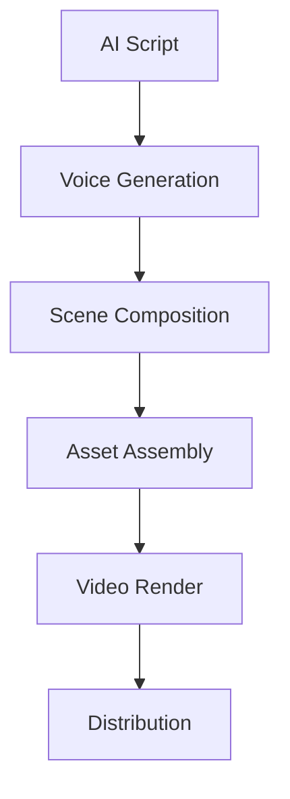
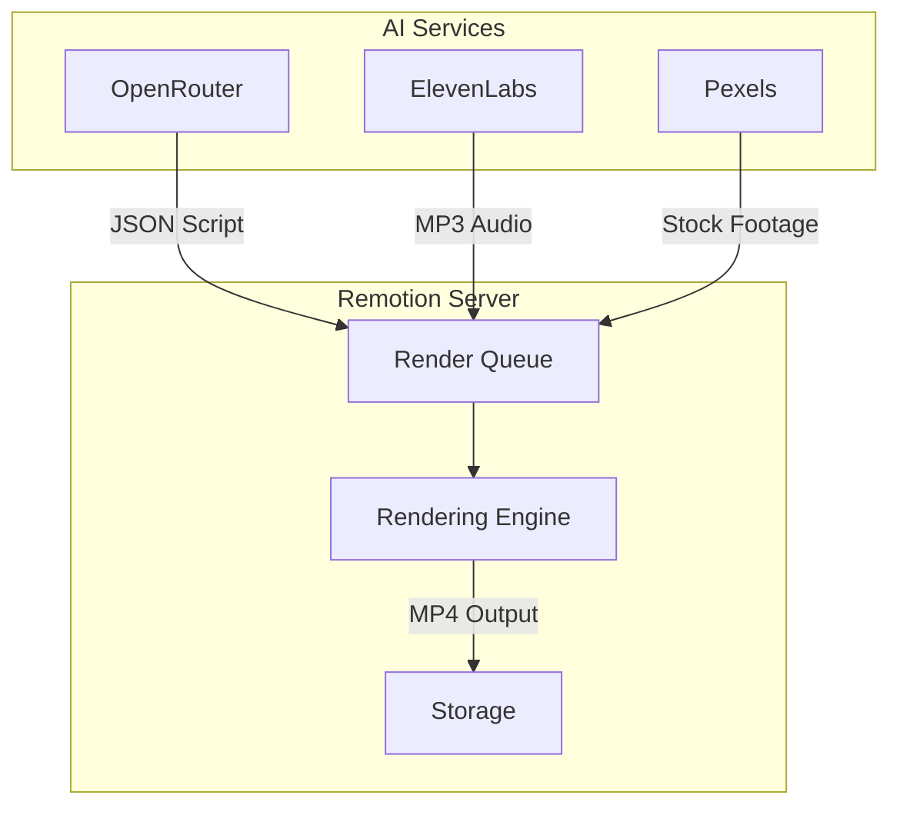

## Concept: AI-Driven Video Assembly

The Remotion video pipeline converts AI-generated banking advice into engaging short videos. Our workflow combines:
- AI-generated scripts (OpenRouter/NVIDIA Nemotron)
- ElevenLabs voice synthesis
- Remotion's React-based video templates
- Pexels API stock footage



## Core Implementation

### Dynamic Script Handling

AI-generated scripts are parsed into JSON structures that define video scenes, voiceover text, and visual elements:

```typescript
// Remotion composition using AI-generated data
const AiVideo: React.FC<{ scriptData: AiScript }> = ({ scriptData }) => {
  return (
    <Composition
      id="AiGeneratedVideo"
      component={() => <VideoTemplate {...scriptData} />}
      durationInFrames={60 * 30} // 30 seconds at 60fps
      fps={60}
      width={1080}
      height={1920} // Vertical format for Shorts/Reels
    />
  );
};

// Video template consuming AI data
const VideoTemplate = ({ scenes, voiceoverUrl }: AiScript) => {
  return (
    <Sequence durationInFrames={60 * 30}>
      {scenes.map((scene, index) => (
        <SceneComponent 
          key={index}
          sceneData={scene}
          voiceover={voiceoverUrl}
        />
      ))}
    </Sequence>
  );
};
```

### ElevenLabs Voice Integration

Voice synthesis happens via API before rendering begins:

```typescript
// Generating voiceover from AI script
async function generateVoiceover(script: AiScript) {
  const response = await fetch('https://api.elevenlabs.io/v1/text-to-speech/CYw3kZ02Hs0563khd1OA', {
    method: 'POST',
    headers: {
      'Content-Type': 'application/json',
      'xi-api-key': process.env.ELEVEN_LABS_KEY!
    },
    body: JSON.stringify({
      text: script.full_text,
      model_id: 'eleven_multilingual_v2',
      voice_settings: {
        stability: 0.5,
        similarity_boost: 0.8
      }
    })
  });
  
  return Buffer.from(await response.arrayBuffer());
}
```

## Infrastructure

### Rendering Queue Architecture



### Cloud Rendering Configuration

```typescript
// remotion.config.ts
import { Config } from 'remotion';

Config.Rendering.setConcurrency(4);
Config.Output.setOverwriteOutput(true);
Config.Bundling.setCachingEnabled(true);
```

## Bonus Features

### Real-time Preview During Development

```typescript
// Local preview with hot-reloading
export const PreviewServer = () => {
  return (
    <Player
      component={() => <VideoTemplate {...demoScript} />}
      durationInFrames={60 * 30}
      compositionWidth={1080}
      compositionHeight={1920}
      fps={60}
      controls
    />
  );
};
```

### Automated A/B Testing

Video variations are generated by modifying template parameters:

```typescript
// Generate multiple variants
const variants = [
  {ctaPosition: 'top', colorScheme: 'dark'},
  {ctaPosition: 'bottom', colorScheme: 'light'}
];

variants.forEach((variant) => {
  queue.addJob({
    template: 'ABTestTemplate',
    inputProps: {...scriptData, ...variant}
  });
});
```

## Conclusion

The AI-Remotion integration enables:
✅ Daily batch processing of video content  
✅ Personalized videos based on user banking questions  
✅ Multi-platform formatted outputs  
✅ Performance tracking through content metadata

Through this technical implementation, GeoGain can scale video content production while maintaining quality and relevance for expat banking topics.
