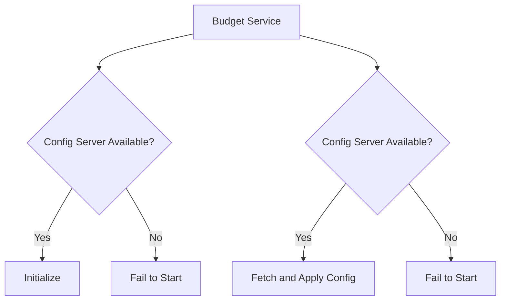

## Introduction

In modern microservice architectures, managing environment-specific configurations efficiently and securely is crucial. Traditional methods of using hardcoded environment variables are no longer adequate for dynamic environments. Enter Spring Cloud Config Server—a powerful tool that provides a centralized 'single source of truth' for configuration properties across all microservices.

This blog post will guide you through setting up and implementing a Git-Backed Config Server to ensure zero restarts, dynamic reconfiguration, and fail-fast behavior in your microservices architecture.

## The GitOps Flow: How the `config-repo` Manages Service Properties

The key to successful configuration management is a robust version-controlled repository. In our Personal Finance Management System (PFMS), we use a local `config-repo` hosted within the project repository. This Git-backed backend strategy ensures that all service properties are stored in a secure, auditable, and centralized location.

### Configuration Repository

The `config-repo` acts as the central hub for all configuration data. Whenever a change is made (e.g., updating budget limits for different environments), this update is committed via a Git push. The Config Server automatically detects these changes and synchronizes its properties from the repository.

### Dynamic Configuration Refresh

Each microservice that subscribes to the Config Server will automatically detect these changes and refresh their configuration without needing a restart. For example, when a new budget limit is pushed to the `config-repo`, the Budget Service will pull this updated property and apply it immediately, ensuring all users see the latest budget information.

## Resilience: The 'Fail-Fast' Model and Its Importance in Microservices

The system we use in PFMS employs a strict fail-fast dependency model. This means that microservices require the `spring-cloud-starter-config` bootstrap to succeed before initialization. If the Config Server is unreachable, no microservice will start up.

### Fail-Fast Behavior

- **Crash on Unreachable Config Server**: By crashing immediately if the Config Server is unreachable, we ensure that only services with valid configurations are running. This prevents misconfigurations from propagating throughout the ecosystem.
  
- **Fail-Safe Deployment**: In cases where manual intervention is required, deploying a 'canary' instance of the microservice ensures that changes do not impact the entire system. If the canary instance encounters issues, it will fail, and the change will be rolled back.

### Practical Example: Show Properties for the Budget Service and API Gateway

#### API Gateway Startup

1. The API Gateway service boots up.
2. It attempts to retrieve its configuration from the Config Server using `spring-cloud-starter-config`.
3. If successful, it proceeds with initialization.
4. If the Config Server is unreachable, the API Gateway will fail to start, preventing any requests from being processed until the issue is resolved.

#### Budget Service Startup

1. The Budget Service boots up.
2. It attempts to retrieve its configuration from the Config Server using `spring-cloud-starter-config`.
3. If successful, it proceeds with initialization and applies the latest budget limits immediately.
4. If the Config Server is unreachable, the Budget Service will fail to start, ensuring that no budget-related operations can be performed.

## Summary

The centralized configuration management strategy in PFMS leverages Spring Cloud Config Server to provide dynamic reconfiguration without service restarts. By using a GitOps workflow and implementing a strict fail-fast dependency model, the system ensures that microservices only start up with valid configurations, maintaining environment consistency and preventing issues caused by misconfigurations.

The Config Server acts as the backbone of this ecosystem, enabling efficient and secure management of configuration properties across all services. With Spring Cloud Config Server, you can achieve zero restarts and ensure a resilient microservices architecture.

---

**Astro Frontmatter:**

```yaml
---
title: Zero Restarts: Implementing a Git-Backed Config Server
date: 2023-10-05T00:00:00Z
description: "Master the heart of your microservices architecture with Spring Cloud Config Server, ensuring dynamic reconfiguration without service restarts."
author: DevOps Evangelist & Technical Writer
---
```

**Architectural Diagram:**

